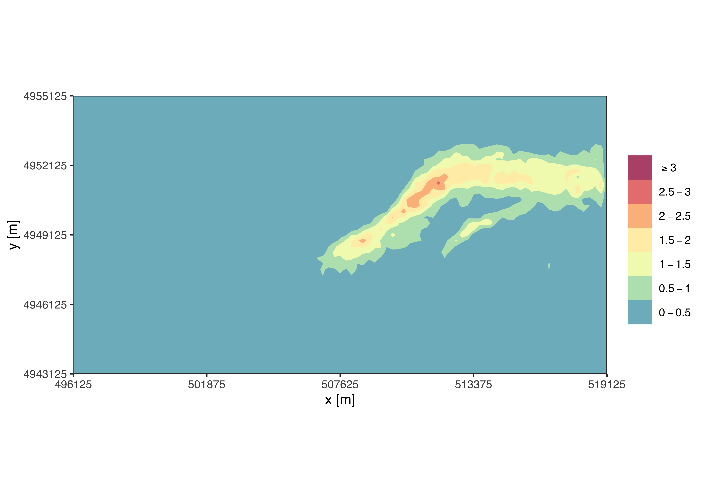
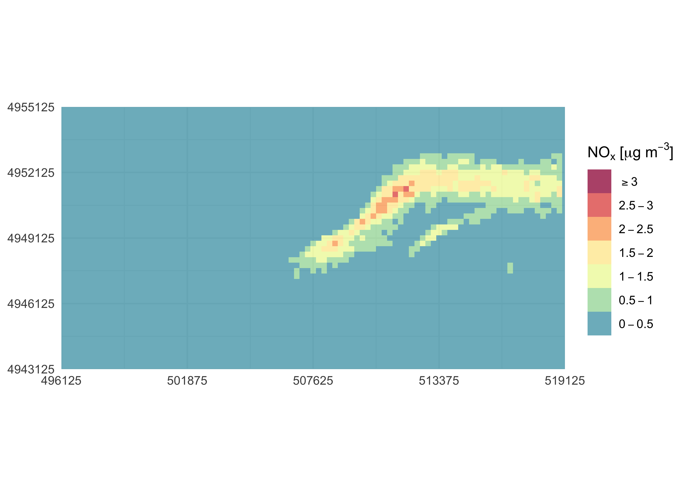

<!-- README.md is generated from README.Rmd. Please edit that file -->

# simulariatools

<!-- badges: start -->
[](https://github.com/Simularia/simulariatools/actions)
[](https://doi.org/10.5281/zenodo.596741)
<!-- badges: end -->

`simulariatools` is an open source collection of functions and tools
useful to pre and post process data for air quality modelling and
assessment. The package is developed and maintained by the people at
[Simularia](https://www.simularia.it) and it is extensively used therein
for daily jobs.

If you use this package in your work, please consider citing it. Refer
to its [Zenodo DOI](https://doi.org/10.5281/zenodo.596741) to cite it.

## simulariatools Table of Contents

-   [Installation](#installation)
-   [Brief examples](#brief_examples)
-   [List of Functions](#list_of_functions)
-   [Contact](#contact)
-   [Contributors](#contributors)
-   [License](https://github.com/Simularia/simulariatools/blob/master/LICENSE.md)
-   [Changelog](https://github.com/Simularia/simulariatools/blob/master/NEWS)

## Installation

The easiest way to install `simulariatools` is form CRAN:

``` r
    install.packages("simulariatools")
```

The development version can be installed from GitHub using the
`devtools` package:

``` r
    devtools::install_github("Simularia/simulariatools")
```

Note: in order to use `importADSOBIN()` to import *ADSO/BIN* data files,
a working installation of *Python 3* is required. For more information
about *R* and *Python* interoperability, please refer to
[`reticulate`](https://rstudio.github.io/reticulate/) documentation.

## Brief examples

### Contour plot

Firt, import air quality data from *NetCDF* or *ADSO/BIN* files with the
appropriate convenience function:

``` r
library(simulariatools)
mydata <- importRaster(file = "./test/conc_avg.nc",
                       k = 1000,
                       destaggering = TRUE,
                       variable = "nox",
                       verbose = TRUE)
#> Loading required namespace: ncdf4
#> 
#> Raster statistics -----------------------------------------------
#>        X (min, max, dx)  :  496000.000   519250.000      250.000
#>        Y (min, max, dy)  : 4943000.000  4955250.000      250.000
#>      nox (min, max, mean):    0.00e+00     2.71e+00     1.52e-01
#> -----------------------------------------------------------------
```

A quick contour plot with default configuration can be easily obtained
by running *contourPlot2()* without any argument:

``` r
contourPlot2(mydata)
```

 The
plot is customisable by using *contourPlot2()* arguments and by piping
*ggplot2* instructions:

``` r
library(ggplot2)
contourPlot2(mydata, 
             domain = c(502000, 519000, 4943125, 4955125, 5, 5),
             levels = c(-Inf, 0.5, 1, 1.5, 2, Inf),
             legend = "NOx [ug/m3]") + 
  labs(x = NULL, y = NULL) +
  theme_minimal()
```



Use `ggsave()` to save the last plot to file:

``` r
ggsave(filename = "~/path/to/myplot.png", width = 7, height = 6, dpi = 300)
```

If a *tile* plot is required:

``` r
library(ggplot2)
contourPlot2(mydata, 
             tile = TRUE,
             legend = "NOx [ug/m3]") + 
  labs(x = NULL, y = NULL) +
  theme_minimal()
```



## List of functions

Available functions are listed below:

-   `contpourPlot2()`
-   `downloadBasemap()`
-   `importRaster()`.
-   `importADSOBIN()`.
-   `importSurferGrd()`.
-   `plotAvgRad()`.
-   `plotAvgTemp()`.
-   `plotStabilityClass()`.
-   `removeOutliers()`.
-   `rollingMax()`.
-   `stabilityClass()`.
-   `vectorField()`.
-   `contourPlot()` obsolete.
-   `createBaseMap()` obsolete.

## Contact

Contact person:

    Giuseppe Carlino
    Simularia s.r.l.
    g.carlino@simularia.it

## Contributors

Matteo Paolo Costa
