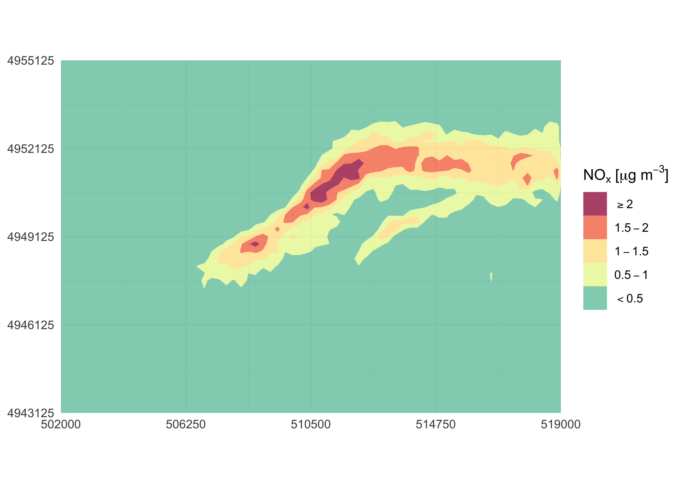

<!-- README.md is generated from README.Rmd. Please edit that file -->

# simulariatools <a href="https://www.simularia.it/simulariatools/"></a>

<!-- badges: start -->

[](https://github.com/Simularia/simulariatools/actions/workflows/R-CMD-check.yaml)
[](https://CRAN.R-project.org/package=simulariatools)
[](https://CRAN.R-project.org/package=simulariatools)
[](https://doi.org/10.5281/zenodo.596741)
<!-- badges: end -->

## Overview

**simulariatools** is an open source package with a collection of
functions and tools useful to pre and post process data for air quality
modelling and assessment:

- `contourPlot2()` plots a production-ready contour map of a pollutant
  concentration field.
- `plotAvgRad()` plots the hourly average of solar radiation.
- `plotAvgTemp()` plots the average atmospheric temperature.
- `plotStabilityClass()` plots histograms of atmospheric stability
  class.
- `vectorField()` plots a simple vector field given two components.
- `importRaster()` imports a generic raster file.
- `importADSOBIN()` imports an ADSO/BIN raster file.
- `importSurferGrd()` imports a grid file.
- `stabilityClass()` computes atmospheric stability class.
- `turnerStabilityClass()` computes atmospheric PGT stability class with
  Turner method.
- `downloadBasemap()` downloads GeoTIFF basemaps from the Italian
  [PCN](https://gn.mase.gov.it/portale/home).
- `removeOutliers()` removes time series outliers based on interquartile
  range.
- `rollingMax()` computes rolling max of a time series.

The package is developed and maintained at
[Simularia](https://www.simularia.it) and it is widely used in their
daily work.

If you use this package in your work, please consider citing it. Refer
to its [Zenodo DOI](https://doi.org/10.5281/zenodo.596741) to cite it.

## Installation

To install the latest release of **simulariatools** from CRAN:

``` r
install.packages("simulariatools")
```

> NOTE: To import *ADSO/BIN* data files via `importADSOBIN()`, a working
> installation of *Python3* is required. For more information about *R*
> and *Python* interoperability, refer to the documentation of
> [`reticulate`](https://rstudio.github.io/reticulate/).

### Development version

To get bug fixes or to use a feature from the development version,
install the development version from GitHub:

``` r
# install.packages("pak")
pak::pkg_install("Simularia/simulariatools")
```

## Examples

### Contour Plot

First, import air quality data from *NetCDF* or *ADSO/BIN* files with
the appropriate convenience function:

``` r
library(simulariatools)
nox_concentration <- importRaster(
    file = "./development/conc_avg.nc",
    k = 1000,
    destaggering = TRUE,
    variable = "nox",
    verbose = TRUE
)
#> Raster statistics -----------------------------------------------
#>        X (min, max, dx)  :   496000.000   519250.000      250.000
#>        Y (min, max, dy)  :  4943000.000  4955250.000      250.000
#>      nox (min, max, mean):     0.00e+00     2.71e+00     1.52e-01
#> -----------------------------------------------------------------
```

Concentration data are imported as a `data.frame` with `x`, `y` columns
corresponding to the coordinates of the cell centre and a `z` column for
grid values.

``` r
str(nox_concentration)
#> 'data.frame':    4557 obs. of  3 variables:
#>  $ x: num  496125 496375 496625 496875 497125 ...
#>  $ y: num  4955125 4955125 4955125 4955125 4955125 ...
#>  $ z: num  0 0 0 0 0 0 0 0 0 0 ...
```

A quick contour plot, with default configuration, can be easily obtained
by running `contourPlot2()` without any argument:

``` r
contourPlot2(nox_concentration)
```


The plot is customisable by using `contourPlot2()` arguments and by
piping **ggplot2** instructions together with the `+` operator.

In the following example, the original domain is cropped, colour levels
are explicitly assigned and a legend name is provided through function
arguments. Furthermore, `labs()` and `theme_minimal()` functions from
**ggplot2** are used to remove axis labels and to change the overall
theme:

``` r
library(ggplot2)
contourPlot2(
    nox_concentration,
    xlim = c(502000, 519000),
    ylim = c(4943125, 4955125),
    nticks = 5,
    levels = c(-Inf, 0.5, 1, 1.5, 2, Inf),
    legend = "NOx [ug/m3]"
) +
    labs(x = NULL, y = NULL) +
    theme_minimal()
```



In order to save the last plot to file, you can directly use the
**ggplot2** function `ggsave()`:

``` r
ggsave(filename = "~/path/to/myplot.png", width = 7, height = 6, dpi = 300)
```

Optional arguments can be used to create special versions of the plot.
For example, use `tile = TRUE` to produce a non-spatially interpolated
plot:

``` r
contourPlot2(
    nox_concentration,
    tile = TRUE,
    legend = "NOx [ug/m3]"
)
```


## Contact

Contact person:

> [Giuseppe Carlino](https://github.com/gcarlino) (Simularia srl)

## Contributors

[Matteo Paolo Costa](https://github.com/teocos)
